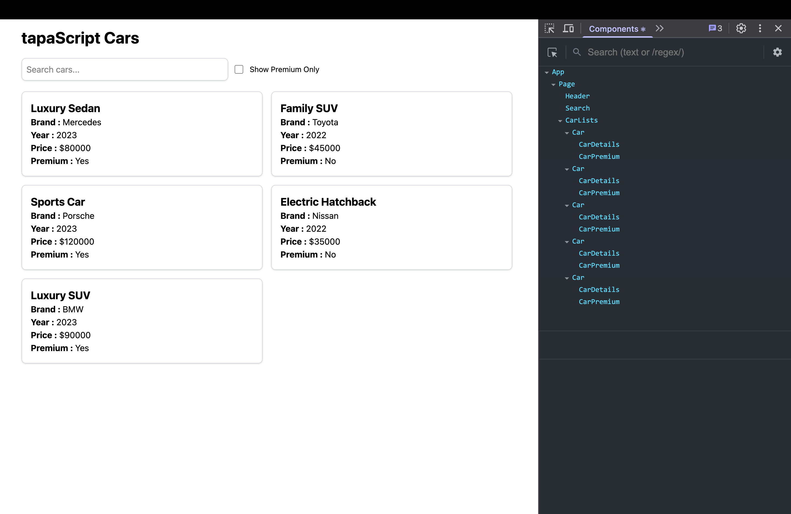

# Task by tapascript - cars layout

Hi, I’m an aspiring self-taught developer currently learning React from **Tapas Da** on the **tapascript Bangla** YouTube channel.
I want to take a moment to express my sincere appreciation and gratitude for the free, in-depth web-development content and courses he provides.

This project is based on a task given in this video:

📺 [https://youtu.be/Byy41AxCK88](https://youtu.be/Byy41AxCK88)

### **Task Objective**

- Break down the page layout into reusable components.
- Create a component tree based on the hierarchy.
- Replicate the exact layout using React.

I did take some reference from the previous video, but in the end, I successfully completed the task. Huge thanks to **Tapas Da** for the clear and detailed explanation of React concepts.

## Live Link

[https://ts-cars.netlify.app/](https://ts-cars.netlify.app/)

## How to Run Locally

1. Clone or fork the repo

   ```bash
    git clone https://github.com/SubhenduThakur/React.git
   ```

2. Navigate to the project folder

3. Install dependencies:

   ```bash
   npm install
   # or
   yarn install
   ```

4. Start the development server
   ```bash
   npm run dev
   # or
   yarn dev
   ```

The app will be available on `http://localhost:5173` by **default**.

---



