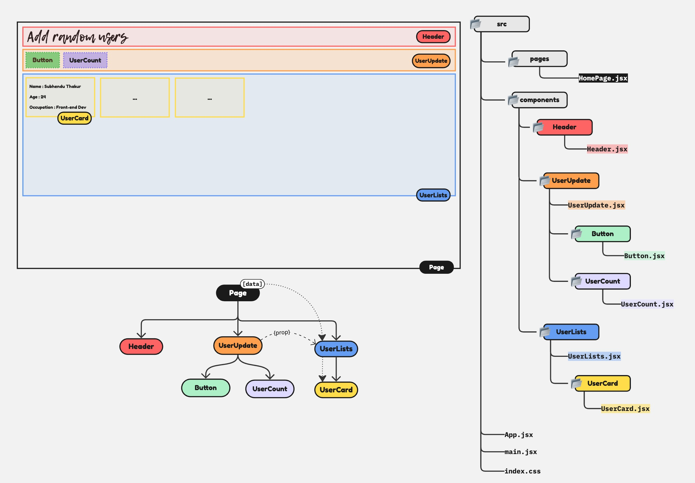

# Task by tapascript - Add random users

[](https://www.linkedin.com/in/subhendu-thakur/)
[](https://x.com/samytarry)

Hi, I’m an aspiring self-taught developer currently learning React from **Tapas Da** on the **tapascript Bangla** YouTube channel.
I want to take a moment to express my sincere appreciation and gratitude for the free, in-depth web-development content and courses he provides.

This project is based on a task given in this video:

▶️ [YouTube](https://youtu.be/fPBW7Pn6O38)

### **Task Objective**

- Add a + icon at the top-right corner of the page. Everytime clicking on it, add a random user into the UI list that shows in the UI. Note: No UI to create to accept inputs to create this new user. Just use Math.random() along with some Test user name to create it.
- Show the total user count somewhere at the top. It should be updated everytime you add a user.

## Live Link

🚀 [Live](https://addradomuser.netlify.app/)

## How to Run Locally

1. Clone or fork the repo

   ```bash
    git clone https://github.com/SubhenduThakur/React.git
   ```

2. Navigate to the project folder

3. Install dependencies:

   ```bash
   npm install
   # or
   yarn install
   ```

4. Start the development server
   ```bash
   npm run dev
   # or
   yarn dev
   ```

The app will be available on `http://localhost:5173` by **default**.

---


